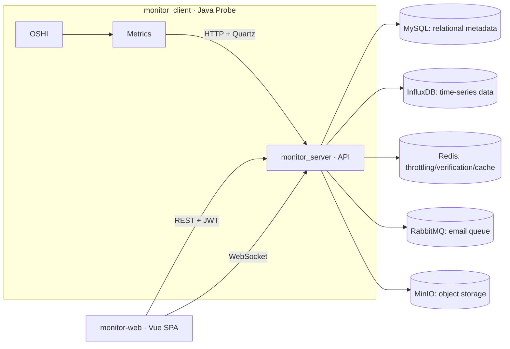

# Server Operations Monitoring System · README (English)

> A lightweight platform for server O&M monitoring built with **Spring Boot**, **Vue 3**, and **InfluxDB**.  
> Modules: `monitor_server/` (backend API), `monitor_client/` (agent/probe), `monitor-web/` (web console).

---

## ✨ Feature Highlights
- **JWT-based multi-tenancy** — issue a JWT on login; enforce fine-grained authorization by role and per-host assignment (including terminal access).
- **One-time registration tokens** — admins mint short-lived tokens; the agent registers once and starts reporting automatically.
- **Real-time and historical metrics** — OS/CPU/MEM/DISK/NET in real time; historical data persisted to **InfluxDB**.
- **In-browser SSH** — server proxies **WebSocket → SSH**; the console embeds xterm.js for interactive sessions.
- **Governance and observability** — Redis throttling, **Snowflake** request IDs across logs, Swagger/OpenAPI for interactive docs.
- **Extensible integrations** — RabbitMQ for email verification codes; optional MinIO object storage hooks.

---

## 🧱 Architecture


---

## 🗂 Repository Layout
```
monitor_server/   Backend: Controllers / Security (JWT) / WebSocket / integrations
monitor_client/   Agent: OSHI sampling / Quartz schedule / register & push
monitor-web/      Frontend: Vue 3 + Vite + Element Plus + Pinia + ECharts + xterm.js
monitor.sql       MySQL DDL: accounts, clients, hardware details, SSH credentials
```

---

## ✅ System Requirements (no Docker Compose)
Install and start the following components, and ensure the backend host can reach them:
- **JDKs** — backend with JDK **24**, agent with JDK **17** (match each module’s `java.version`).
- **Node.js and npm** — for frontend development and build.
- **Core services** — MySQL (database `monitor`), Redis, RabbitMQ, MinIO, SMTP, InfluxDB.

Quick sanity checks:
- MySQL: `mysql -h <host> -u <user> -p -e "SELECT 1"`  
- Redis: `redis-cli -h <host> -a <password> PING`  
- InfluxDB: open `http://<host>:8086` and ensure org/bucket/token are configured

---

## 🚀 Quick Start

### 1) Initialize the database
```sql
-- Execute the bundled DDL in MySQL
SOURCE /path/to/monitor.sql;
```

### 2) Configure and run the backend (`monitor_server/`)
Edit `src/main/resources/application-dev.yml`:
- MySQL / Redis / RabbitMQ / MinIO / SMTP / InfluxDB endpoints and credentials
- `spring.security.jwt.expire` — JWT lifetime (hours)
- `spring.web.flow.*` — API throttling thresholds

Start:
```bash
cd monitor_server
./mvnw spring-boot:run
```
Key endpoints:
- Ops API: `/api/**`
- Probe ingress: `/monitor/**`
- WebSocket SSH: `/terminal/{clientId}`
- Docs: `/swagger-ui/`

### 3) Run the frontend (`monitor-web/`)
```bash
cd monitor-web
npm install
# Point VITE_API_BASE to the backend (e.g., http://127.0.0.1:8080)
npm run dev
```
> If you see “outside of serving allow list”, relax `server.fs.allow` in `vite.config.ts` **for development only**.

### 4) Run the agent (`monitor_client/`)
```bash
cd monitor_client
mvn spring-boot:run
```
On first run, provide the backend URL, the **one-time registration token**, and the network interface to monitor. After registration the agent reports automatically.

---

## ⚙️ Configuration Cheat Sheet
| Key | Purpose | Recommendation |
|---|---|---|
| MySQL url/user/pass | Relational datasource | Use a least-privileged dedicated user in production |
| Redis host/password | Throttling/verification/cache | Always enable auth; separate environments |
| InfluxDB url/org/bucket/token | Time-series storage | Grant only minimal read/write permissions |
| RabbitMQ url/credentials | Email verification queue | Enable durable queues and auth |
| MinIO url/key/secret | Optional object storage | Restrict to required buckets and policies |
| `spring.security.jwt.expire` | JWT lifetime (hours) | 2–12 h in prod, with blacklist/kickout strategy |
| CORS allowed origins | Web console allow-list | Lock down before deployment |
| `spring.quartz.*` | Agent schedule | Tune by data volume and cost |

---

## 🛠 Common Operations
**Create a registration token (admin)**
```bash
curl -H "Authorization: Bearer <JWT>" http://<server>/api/monitor/register
```

**Agent-related endpoints (server-side)**
- Register: `POST /monitor/register`
- Base hardware profile: `POST /monitor/detail`
- Runtime metrics: `POST /monitor/runtime`

**Browser SSH**
- Save SSH credentials: `POST /api/monitor/ssh-save`
- Open the “Terminal” drawer in the UI → server establishes `/terminal/{clientId}` WebSocket → SSH

---

## 🔐 Security Best Practices
- Use a strong, random **JWT secret**; enable **HTTPS** and **HSTS**.
- Enforce a strict **CORS allow-list**; consider MFA or IP allow-list on admin surfaces.
- Require auth for Redis/RabbitMQ/MinIO/InfluxDB; scope permissions narrowly.
- Centralized logging with rotation; correlate requests via **Snowflake IDs**.

---

## 🩺 Operations & Troubleshooting
**No charts/data** — verify InfluxDB org/bucket/token/url; ensure the agent is running and Quartz is active.  
**Registration or ingest failures** — check whether the one-time token was already used; inspect the agent console and backend logs; correlate via Snowflake ID.  
**SSH connection issues** — validate username/key/port and bastion reachability; ensure the reverse proxy does not block WebSocket upgrade.  
**CORS errors** — adjust backend CORS origins to match the frontend domain; relax only for local development.

---

## 📈 Metrics (examples)
- **CPU** — logical cores, load, usage %
- **Memory** — total, available, usage %
- **Disk** — total, used, free, I/O (extensible)
- **Network** — up/down throughput (Bytes/s), interface name
- **Host metadata** — OS, version, IP, location tags, etc.

> Metrics are written to InfluxDB with hostId/metric modeled as measurement/tags for efficient aggregation and queries.

---

## 🔧 Deployment Notes
- **Development** — run backend and frontend separately; set `VITE_API_BASE` to the local backend.  
- **Production** — reverse proxy (Nginx/Caddy) in front of the backend; enable TLS and WebSocket passthrough. Serve the built frontend via the reverse proxy.  
- **Capacity planning** — size InfluxDB retention/storage by report interval × host count; split buckets if necessary.

---

## 📄 License & Credits
- License — see repository `LICENSE` (or assume all rights reserved if absent).
- Credits — Spring Boot, OSHI, Quartz, MyBatis-Plus, Redis, RabbitMQ, MinIO, InfluxDB, Swagger/OpenAPI, Vue 3, Element Plus, Pinia, ECharts, xterm.js.

---

## 📚 Terminology Glossary (EN ⇄ ZH)
| English | 中文 |
|---|---|
| Agent / Probe | 采集端 / 探针 |
| Web console | 前端控制台 |
| Registration token (one-time) | 一次性注册令牌 |
| WebSocket → SSH | WebSocket 代理到 SSH |
| Runtime snapshot | 运行时快照 |
| Hardware profile | 硬件画像 |
| Throttling | 限流 |
| Snowflake IDs | 雪花 ID |
| Allow-list | 白名单 |
| Bastion host | 堡垒机 |
| Retention policy (RP) | 保留策略（RP） |
