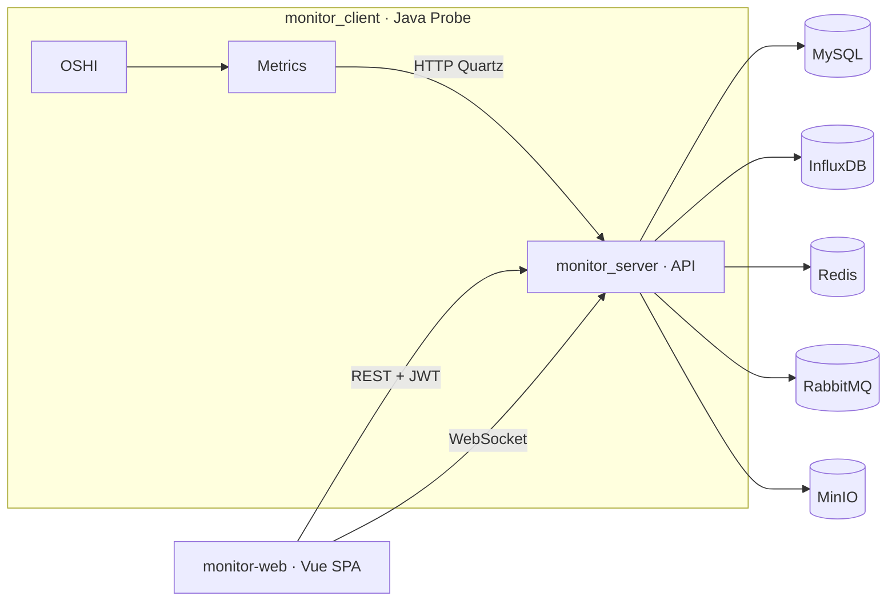

# Server Operations Monitoring System · README 

> A full-stack **Spring Boot + Vue 3 + InfluxDB** platform for server O&M monitoring.  
> Modules: `monitor_server/` (backend), `monitor_client/` (Java probe/agent), `monitor-web/` (SPA console).

---

## Highlights
- **Multi-tenant & JWT auth** with role-aware host scoping and terminal permissions.
- **Token-based agent onboarding** (single-use registration tokens, heartbeat scheduling).
- **Live & historical metrics** (OS/CPU/MEM/DISK/NET) persisted to **InfluxDB**.
- **Browser SSH** via server-proxied **WebSocket → SSH** with embedded xterm.js.
- **Governance & observability**: Redis throttling, Snowflake request IDs, Swagger/OpenAPI.
- **Messaging & object hooks**: RabbitMQ for email workflows, optional MinIO integration.

---

## Architecture



---

## Repository Layout
```
monitor_server/   # Spring Boot backend: REST, Security/JWT, WebSocket, integrations
monitor_client/   # Java probe: OSHI sampling, Quartz schedule, register & push
monitor-web/      # Vue 3 + Vite + Element Plus + Pinia + ECharts + xterm.js
monitor.sql       # MySQL schema: accounts, clients, hardware details, SSH creds
```

---

## Prerequisites
- **JDKs**: backend on **Java 24**, probe on **Java 17** (match each module’s `java.version`).
- **Node.js & npm** for Vite dev server and SPA build.
- **Infra services**: MySQL (`monitor` DB), Redis, RabbitMQ, MinIO, SMTP, InfluxDB.

> Tip: prefer containerized orchestration (e.g., Docker Compose) for production-like setups.

---

## Quick Start

### 1) Database
```sql
-- Execute the bundled DDL
SOURCE /path/to/monitor.sql;
```

### 2) Backend (`monitor_server/`)
- Edit `src/main/resources/application-dev.yml` for:
  - MySQL / Redis / RabbitMQ / MinIO / SMTP / InfluxDB endpoints & credentials
  - JWT expiration, throttling thresholds, etc.
- Run:
```bash
cd monitor_server
./mvnw spring-boot:run
```
- Key endpoints:
  - Ops API: `/api/**`
  - Probe ingress: `/monitor/**`
  - WebSocket SSH: `/terminal/{clientId}`
  - Docs: `/swagger-ui/`

### 3) Frontend (`monitor-web/`)
```bash
cd monitor-web
npm install
# point VITE_API_BASE to backend
npm run dev
```
> If Vite complains about “outside of serving allow list”, loosen `server.fs.allow` in `vite.config.ts` (dev only).

### 4) Probe (`monitor_client/`)
```bash
cd monitor_client
mvn spring-boot:run
```
On first run provide:
- **Server URL**
- **One-time registration token** (from console or `GET /api/monitor/register`)
- Network interface to watch

After registration the probe:
- Sends **static hardware profile** (OS/CPU/MEM/DISK/IP)
- Pushes **runtime snapshots** on Quartz schedule (CPU/MEM/NET etc.)

---

## Common Tasks

### Create a registration token (admin)
```bash
curl -H "Authorization: Bearer <JWT>" \
  http://<server>/api/monitor/register
```

### Probe endpoints (server side)
- Register: `POST /monitor/register`
- Base profile: `POST /monitor/detail`
- Runtime metrics: `POST /monitor/runtime`

### Browser SSH
- Save host SSH creds: `POST /api/monitor/ssh-save`
- Open terminal drawer in UI → server handles `/terminal/{clientId}` WebSocket → SSH

---

## Security & Tenancy
- **JWT** after login; **role + host assignment** gate UI and terminal access.
- Maintain strict **CORS allow-list** for deployment origins.
- **Redis throttling** against abuse; **Snowflake request IDs** across logs.

---

## Configuration Notes (examples)
- `spring.security.jwt.expire` — JWT lifetime (hours)
- `spring.web.flow.*` — API throttle thresholds
- `spring.quartz.auto-startup=true` — enable probe schedules
- InfluxDB org/bucket/token/url — must match backend `InfluxDbUtils`

---

## Troubleshooting
- **Registration/ingest errors**: check probe console and backend logs; correlate via Snowflake request ID.
- **No charts/data**: verify InfluxDB connectivity, bucket/token; ensure probe is running and scheduled.
- **SSH failures**: validate credentials and network reachability; confirm WebSocket not blocked by reverse proxy.
- **CORS issues**: update backend `SecurityConfiguration` origins to match your frontend.

---

## License & Credits
- License: see repository `LICENSE` (or assume all rights reserved if absent).
- Credits: Spring Boot, OSHI, Quartz, MyBatis-Plus, Redis, RabbitMQ, MinIO, InfluxDB, Swagger/OpenAPI, Vue 3, Element Plus, Pinia, ECharts, xterm.js.
