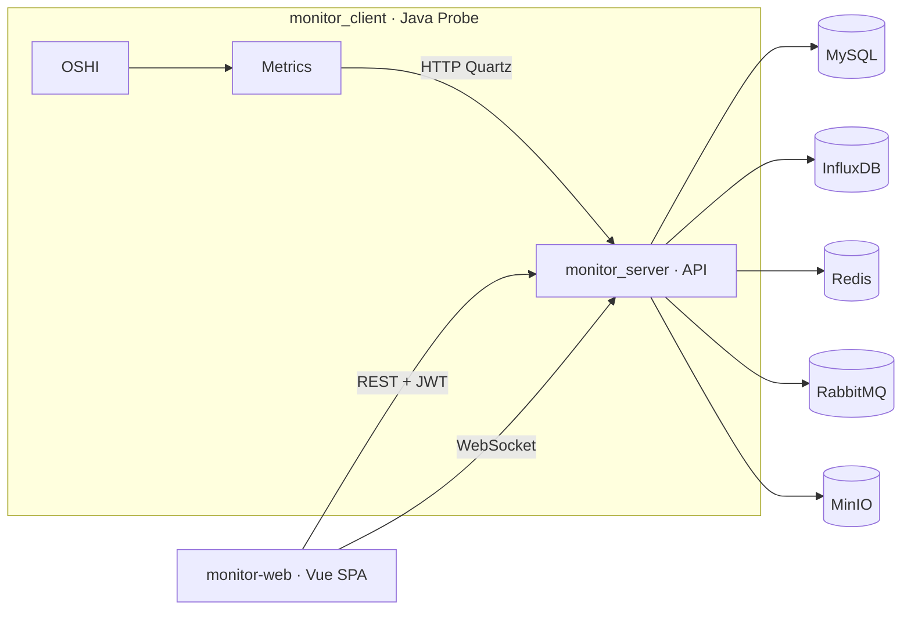

# 服务器运维监控系统 · README（中文）

> 一个由 **Spring Boot + Vue 3 + InfluxDB** 组成的全栈服务器运维监控平台。  
> 模块：`monitor_server/`（后端）、`monitor_client/`（采集端/探针）、`monitor-web/`（前端控制台）。

---

## 功能概览
- **多租户 / JWT 认证**：登录颁发 JWT，基于角色/主机授权控制页面能力与终端权限。
- **客户端注册与心跳**：管理员生成一次性注册令牌；探针使用令牌注册并按计划上报。
- **实时 + 历史指标**：OS、CPU、内存、磁盘、网络等指标实时展示并落库 InfluxDB。
- **浏览器原生 SSH**：后端代理 WebSocket → SSH，前端内嵌 xterm.js 交互。
- **治理与审计**：Redis 限流、雪花 ID 贯穿请求日志、Swagger/OpenAPI 调试。
- **消息与对象存储**：RabbitMQ 邮件验证码、MinIO 对象存储挂载（按需）。

---

## 架构



---

## 代码结构
```
monitor_server/   # Spring Boot 后端：Controller、Security/JWT、WebSocket、集成组件
monitor_client/   # Spring Boot 探针：OSHI 采集、Quartz 定时、注册与上报
monitor-web/      # Vue 3 + Vite + Element Plus + Pinia + ECharts + xterm.js
monitor.sql       # MySQL DDL：账号、客户端、硬件详情、SSH 凭据
```

---

## 环境准备
- **JDK**：后端 JDK **24**，客户端 JDK **17**（按各模块 `java.version` 安装）。
- **Node.js & npm**：前端构建与 Vite 开发服务器。
- **基础服务**：MySQL（库名 `monitor`）、Redis、RabbitMQ、MinIO、SMTP、InfluxDB。

> 提示：生产环境建议用容器编排（如 Docker Compose）统一拉起上述依赖。

---

## 快速上手

### 1) 初始化数据库
```sql
-- 在 MySQL 中执行仓库自带的 monitor.sql
SOURCE /path/to/monitor.sql;
```

### 2) 配置与启动后端（`monitor_server/`）
- 修改 `src/main/resources/application-dev.yml` 填写：
  - MySQL / Redis / RabbitMQ / MinIO / SMTP / InfluxDB 地址与凭据
  - JWT 有效期与限流阈值等
- 运行：
```bash
cd monitor_server
./mvnw spring-boot:run
```
- 主要端点：
  - 运维 API：`/api/**`
  - 探针上报：`/monitor/**`
  - WebSocket SSH：`/terminal/{clientId}`
  - 文档：`/swagger-ui/`

### 3) 启动前端（`monitor-web/`）
```bash
cd monitor-web
npm install
# 可用环境变量 VITE_API_BASE 指向后端地址
npm run dev
```
> 如遇 Vite “outside of serving allow list” 报错，可在 `vite.config.ts` 里适度放宽 `server.fs.allow`（仅开发环境使用）。

### 4) 部署探针（`monitor_client/`）
```bash
cd monitor_client
mvn spring-boot:run
```
首次启动将提示：
- 服务器地址（后端根地址）
- **一次性注册令牌**（管理员在前端或 `GET /api/monitor/register` 申请）
- 需要监控的网络接口名

注册成功后，探针会：
- 提交硬件静态画像（OS / CPU / 内存 / 磁盘 / IP 等）
- 按 Quartz 计划周期性上报运行时快照（CPU/内存/网络等）

---

## 常用操作

### 生成注册令牌（管理员）
```bash
curl -H "Authorization: Bearer <JWT>" \
  http://<server>/api/monitor/register
```

### 探针注册与上报（后端）
- 注册：`POST /monitor/register`
- 上报硬件：`POST /monitor/detail`
- 上报运行时：`POST /monitor/runtime`

### 浏览器 SSH
- 保存主机 SSH 凭据：`POST /api/monitor/ssh-save`
- 前端打开终端抽屝，后端通过 `/terminal/{clientId}` 建立 WS → SSH 转发

---

## 安全与多租户
- 登录后发放 **JWT**；基于 **角色** 与 **主机分配** 控制可见与可操作对象。
- 关键接口设置 **CORS 白名单**，需根据部署域名调整。
- **Redis 限流** 防爆破；**雪花 ID** 贯穿日志方便定位。

---

## 配置要点（示例）
- `spring.security.jwt.expire`：JWT 过期小时数
- `spring.web.flow.*`：接口限流阈值
- `spring.quartz.auto-startup=true`：探针定时上报
- InfluxDB：组织/桶/Token/URL（与后端 `InfluxDbUtils` 配置一致）

---

## 故障排查
- **注册/上报失败**：查看探针控制台与后端日志；按雪花 ID 关联请求。
- **图表无数据**：核对 InfluxDB 连接/桶名/Token；确认探针在定时上报。
- **SSH 失败**：检查凭据、堡垒机/端口可达性；确认 WebSocket 未被反向代理拦截。
- **前端跨域**：更新后端 `SecurityConfiguration` 的 CORS 允许来源。

---

## 许可与致谢
- 开源许可：请以仓库 LICENSE 为准（未提供则视为保留所有权利）。
- 第三方组件：Spring Boot、OSHI、Quartz、MyBatis-Plus、Redis、RabbitMQ、MinIO、InfluxDB、Swagger/OpenAPI、Vue 3、Element Plus、Pinia、ECharts、xterm.js。
