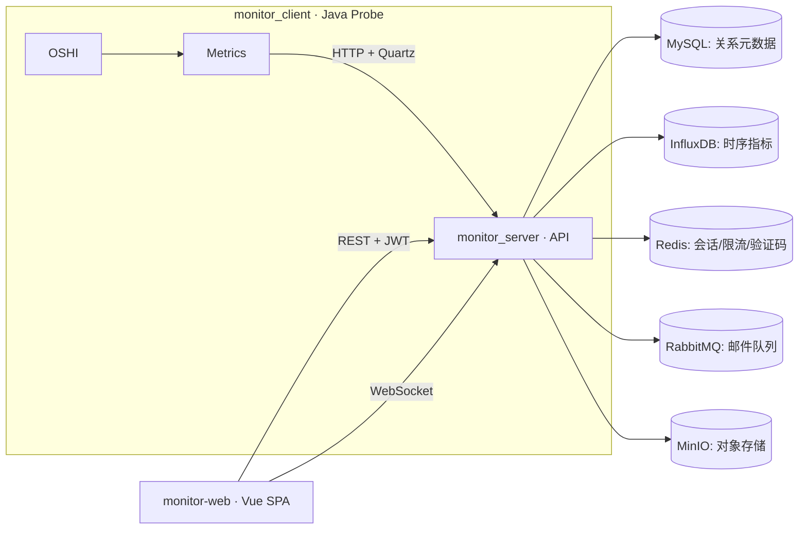

# 服务器运维监控系统（中文 README）

> 基于 **Spring Boot + Vue 3 + InfluxDB** 的轻量级服务器运维监控平台。  
> 模块：`monitor_server/`（后端 API）、`monitor_client/`（Java 采集端/探针）、`monitor-web/`（前端控制台）。

---

## ✨ 特性亮点
- **JWT 多租户**：登录颁发 JWT，按角色与主机分配细粒度授权（含终端权限）。
- **一次性令牌注册**：管理员生成短期令牌，探针注册后自动开始上报。
- **实时 + 历史指标**：CPU / 内存 / 磁盘 / 网络等，实时展示，历史写入 **InfluxDB**。
- **浏览器 SSH**：后端 WebSocket 代理到 SSH，前端内嵌 xterm.js 交互。
- **治理与观测**：Redis 限流、雪花 ID 请求日志、Swagger/OpenAPI 接口文档。
- **可拓展集成**：RabbitMQ 邮件验证码流程、MinIO 对象存储挂载（可选）。

---

## 🧱 架构概览


---

## 🗂 目录结构
```
monitor_server/   后端：Controller / Security(JWT) / WebSocket / 集成组件
monitor_client/   探针：OSHI 采集 / Quartz 定时 / 注册 & 上报
monitor-web/      前端：Vue 3 + Vite + Element Plus + Pinia + ECharts + xterm.js
monitor.sql       MySQL DDL：账户、客户端、硬件详情、SSH 凭据
```

---

## ✅ 环境要求（不使用 Docker Compose）
请在目标主机上**自行安装并启动**以下组件，确保后端主机能够访问：
- **JDK**：后端 JDK **24**；探针 JDK **17**（与各模块 `java.version` 一致）。
- **Node.js & npm**：用于前端开发与构建。
- **基础服务**：MySQL（库名 `monitor`）、Redis、RabbitMQ、MinIO、SMTP、InfluxDB。

> 建议在安装后用命令行快速自检：
> - MySQL：`mysql -h <host> -u <user> -p -e "SELECT 1"`  
> - Redis：`redis-cli -h <host> -a <password> PING`  
> - InfluxDB：浏览器访问 `http://<host>:8086` 并确认组织/桶/Token 已创建  

---

## 🚀 快速开始

### 1) 初始化数据库
```sql
-- 在 MySQL 中执行仓库自带的 DDL
SOURCE /path/to/monitor.sql;
```

### 2) 配置并启动后端（`monitor_server/`）
编辑 `src/main/resources/application-dev.yml`：
- MySQL / Redis / RabbitMQ / MinIO / SMTP / InfluxDB 连接信息
- `spring.security.jwt.expire`（JWT 过期小时）
- `spring.web.flow.*`（接口限流阈值）

启动：
```bash
cd monitor_server
./mvnw spring-boot:run
```
主要端点：
- 运维 API：`/api/**`
- 探针上报：`/monitor/**`
- WebSocket SSH：`/terminal/{clientId}`
- 文档：`/swagger-ui/`

### 3) 启动前端（`monitor-web/`）
```bash
cd monitor-web
npm install
# 将 VITE_API_BASE 指向后端地址（例如 http://127.0.0.1:8080）
npm run dev
```
> 若遇 Vite “outside of serving allow list”，仅在 **开发环境** 放宽 `vite.config.ts` 的 `server.fs.allow`。

### 4) 启动探针（`monitor_client/`）
```bash
cd monitor_client
mvn spring-boot:run
```
首次运行请填写：后端地址、**一次性注册令牌**、监控的网络接口名。注册成功后自动上报。

---

## ⚙️ 关键配置（速查）
| 配置项 | 作用 | 建议 |
|---|---|---|
| MySQL.url/user/pass | 关系数据源 | 生产使用专用账号与最小权限 |
| Redis.host/password | 限流/验证码/缓存 | 必配密码，区分环境 |
| InfluxDB.url/org/bucket/token | 时序指标存储 | 仅授予写入/读取所需最小权限 |
| RabbitMQ.url/cred | 邮件验证码队列 | 开启持久化与鉴权 |
| MinIO.url/key/secret | 可选对象存储 | 仅开放必须的桶与策略 |
| `spring.security.jwt.expire` | JWT 有效期（小时） | 生产 2~12 小时并配合黑名单/踢出策略 |
| CORS 允许源 | 前端域名白名单 | 部署前务必收紧 |
| `spring.quartz.*` | 探针上报计划 | 视数据量与成本调整周期 |

---

## 🛠 常用操作
**生成注册令牌（管理员）**
```bash
curl -H "Authorization: Bearer <JWT>" http://<server>/api/monitor/register
```

**探针上报接口（服务端）**
- 注册：`POST /monitor/register`
- 硬件画像：`POST /monitor/detail`
- 运行时指标：`POST /monitor/runtime`

**浏览器 SSH**
- 保存 SSH 凭据：`POST /api/monitor/ssh-save`
- 前端打开主机的“终端”抽屉 → 后端 `/terminal/{clientId}` 建立 WebSocket → SSH 转发

---

## 🔐 安全实践
- 使用强随机 **JWT Secret**，并启用 **HTTPS** 与 **HSTS**。
- 严格 **CORS 白名单**；后台管理路径可加二次校验（如 IP 白名单/MFA）。
- Redis/RabbitMQ/MinIO/InfluxDB 一律开启认证并细分权限。
- 记录与轮转日志（按 **雪花 ID** 串联请求链路）。

---

## 🩺 运维与排错
**无图表数据**  
- 核对 InfluxDB org/bucket/token/url；确认探针在运行且定时任务已启动。

**注册或上报失败**  
- 检查一次性令牌是否已被使用；查看探针控制台与后端日志，用雪花 ID 关联请求。

**SSH 无法连接**  
- 校验用户名/私钥/端口/堡垒机连通；确认反向代理未拦截 WebSocket。

**前端跨域**  
- 将后端 CORS 允许源调整为前端域名；本地联调可临时放宽。

---

## 📈 指标说明（示例）
- **CPU**：逻辑核数、load、usage（%）
- **内存**：总量、可用、使用率（%）
- **磁盘**：总量、已用、剩余、I/O（可拓展）
- **网络**：上/下行速率（Byte/s）、接口名
- **主机元数据**：OS、版本、IP、位置标签等

> 时序写入 InfluxDB，按 hostId/metric 做表/标签区分，便于聚合与查询。

---

## 🔧 部署建议
- **开发**：前后端分别运行；前端 `VITE_API_BASE` 指向本地后端。
- **生产**：使用 Nginx/Caddy 反向代理到后端，开启 TLS 与 WebSocket 透传；前端打包静态文件后由反代托管。
- **容量规划**：根据上报周期与主机数量规划 InfluxDB 存储与保留策略（RP），必要时分桶。

---

## 📄 许可与致谢
- 许可：以仓库 `LICENSE` 为准（缺省视为保留所有权利）。
- 组件：Spring Boot、OSHI、Quartz、MyBatis-Plus、Redis、RabbitMQ、MinIO、InfluxDB、Swagger/OpenAPI、Vue 3、Element Plus、Pinia、ECharts、xterm.js。
